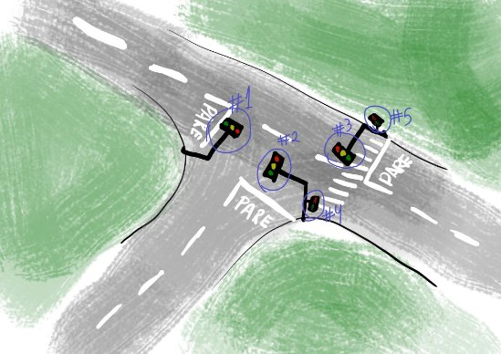

# Trabalho da disciplina CI1068 - Circuitos Lógicos 

O objetivo deste trabalho consiste na criação de um circuito lógico destinado ao controle de cinco semáforos, conforme a imagem acima. O desenvolvimento deste projeto se fundamenta nos conceitos de FSM (Máquinas de Estados Finitos) para a definição dos estados do semáforo e nos mapas de Karnaugh para a elaboração dos circuitos lógicos. O [relatório](relatorio.pdf) apresenta todo o embasamento lógico necessário para a realização da implementação do circuito, contemplando as máquinas de estados, as tabelas dos circuitos desenvolvidas por meio de mapas de Karnaugh, bem como a implementação efetiva por meio do arquivo denominado "semaforo.circ".